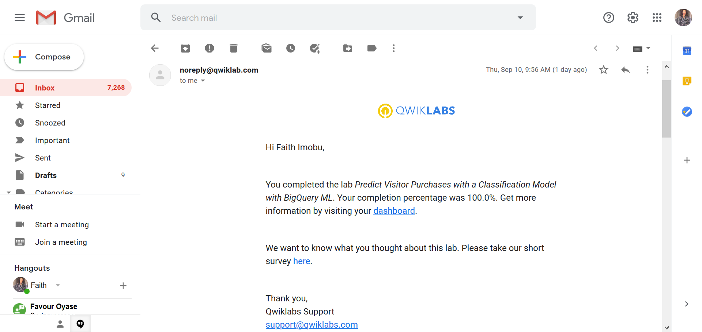

# GADS-2020-Project
Documentation for my GADS 2020 project.

  
App Dev - Adding User Authentication to your Application: Node.js

  

  
Predict Visitor Purchases with a Classification Model with BigQuery ML

  

  
Lab: Create a Streaming Data Pipeline for a Real-Time Dashboard with Cloud Dataflow

  

  
App Dev: Storing Application Data in Cloud Datastore v1.1

  

  
App Dev: Storing Image and Video Files in Cloud Storage v1.1

  

  
Explore a BigQuery Public Dataset

  

  
Recommend Products using ML with Cloud SQL and Dataproc

  

  
App Dev: Setting up a Development Environment v1.1

  

  
Google Cloud Fundamentals: Getting Started with App Engine

  

  
Google Cloud Fundamentals: Getting Started with GKE

  

  
Google Cloud Fundamentals: Getting Started with Deployment Manager and Cloud Monitoring

  

  
Google Cloud Fundamentals: Getting Started with BigQuery

  

  
Google Cloud Fundamentals: Getting Started with Cloud Marketplace

  

  
Google Cloud Fundamentals: Getting Started with Cloud Storage and Cloud SQL

  

  
Google Cloud Fundamentals: Getting Started with Compute Engine

  

 

# QwikLabs Completed
A list of labs completed.

# Translation Code

  
Google Cloud Fundamentals -  Getting Started App Engine 

 https://github.com/Omokhepe/GADS-2020-Project/blob/master/Google%20Cloud%20Fundamentals-Getting%20Started%20with%20App%20Engine.ps1

 

  
Google Cloud Fundamentals -  Getting Started with Compute Engine 

https://github.com/Omokhepe/GADS-2020-Project/blob/master/Getting%20Started%20with%20Compute%20Engine.ps1

 

  
Google Cloud Fundamentals -  Getting Started with GKE 

https://github.com/Omokhepe/GADS-2020-Project/blob/master/Google%20Cloud%20Fundamentals%20Getting%20Started%20with%20GKE.ps1

